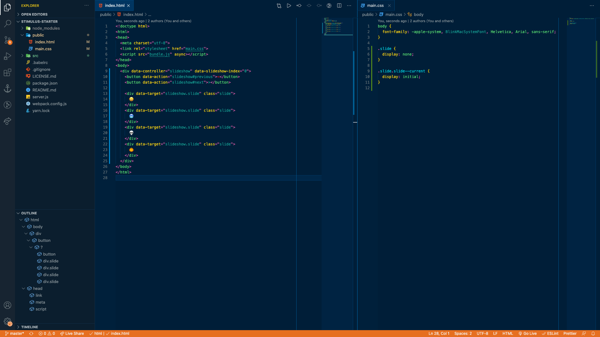

# Kraken Theme for VS Code

## Installation
1. Open Extensions sidebar panel in VS Code.
2. Search for `Kraken Theme` - find the one by **Isaiah Colson**.
3. Click **install** to install this theme.
4. Code > Preferences > Color Theme > **Kraken Theme**

## Contributing
To contribute to this theme:

1. Clone this repo and open in VS Code
2. Open run **View > Run** or shortcut `⇧⌘D`.
3. This will open a side panel where you can press the **play button** that will 'Start Debugging'.
4. Make changes in **themes > Kraken Theme-color-theme.json**. As you make changes to specific colors, you will see an update in the new editor window that opened in step 3.
5. Please reference "Kraken Design Theme" for colors to use. If you don't know what that is, then this is not the right theme for you to be contributing on.

If you are opening a pull request, please include a screenshot that shows before and after.

## Deploying a New Version
These may not apply to you, so don't worry about what is posted in this section.

1. Increment the version number in **package.json**.
2. Use MAJOR.MINOR.PATCH numbering system.

## If You Don't Like Something
If you hate everything about this, then don't use it...

However, if there's something you don't like and you'd like to contribute, follow the steps listed above.

You can also open an issue and let me know. I do not work in some languages, but I did leave a couple of instances where text may show as `#FF0000` which is bright red. If so, then this is indication that this has not been completed.
